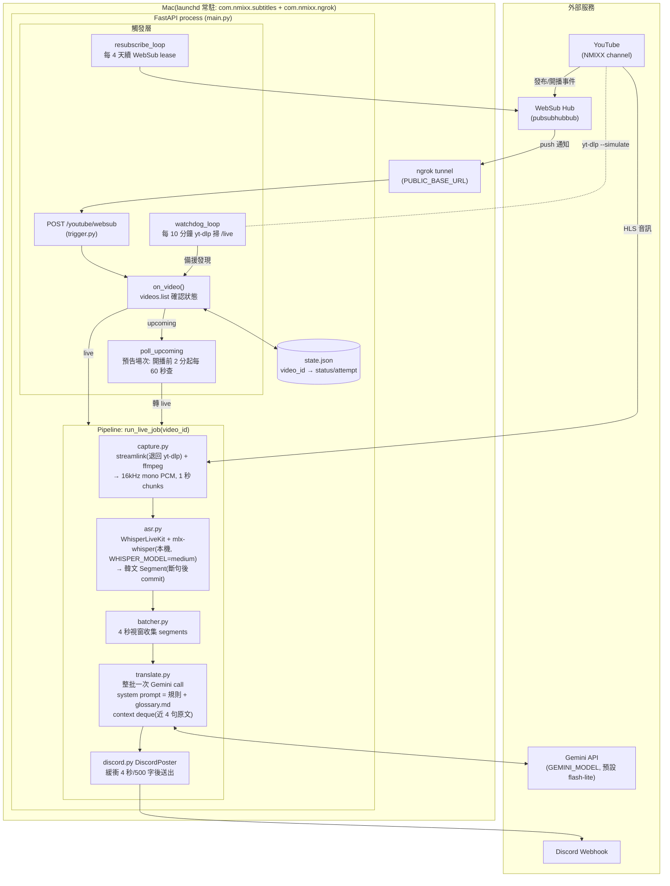

# 架構設計

單一 Python process（FastAPI），跑在 Mac 上由 launchd 常駐，一次只處理一場直播。
整體分三層：**觸發層**（發現直播）、**Pipeline**（音訊 → 字幕）、**狀態與韌性**（重試與重開機恢復）。



## 觸發層（怎麼知道開播了）

主要靠 **WebSub push**：啟動時向 hub 訂閱頻道（lease 5 天，`resubscribe_loop` 每 4 天續約），
YouTube 有新影片/開播就 push 到 `POST /youtube/websub`（經 ngrok 進來）。收到後 `on_video()`
用 YouTube Data API `videos.list` 確認真實狀態：

- `live` → 直接開 job
- `upcoming` → `poll_upcoming`：排定開播前 2 分鐘開始每 60 秒查一次，2 小時沒開播就放棄
- 其他（已結束/非直播）→ 記錄後忽略

備援是 **watchdog**：每 10 分鐘用 `yt-dlp --simulate` 掃頻道 `/live` 頁，接住 WebSub 漏掉的場次。

## Pipeline（run_live_job，直播期間持續執行）

```
streamlink/ffmpeg → 1s PCM chunks → WhisperLiveKit(本機 Whisper) → 韓文句子
→ 4 秒 micro-batch → Gemini 一次翻整批(glossary 進 system prompt)
→ DiscordPoster 緩衝(4s/500 字) → webhook
```

成本設計：ASR 全本機不花錢；翻譯靠 micro-batch 把 API 呼叫壓到約每分鐘 2–5 次，
model 由 `GEMINI_MODEL` env 控制。翻譯失敗或行數不符時 fallback 成 `[KR] 原文`，永不中斷 job。

## 狀態與韌性

- `state.json`（plain JSON，單 process 夠用）：以 video_id 記錄狀態機
  `upcoming → live → completed`，失敗記 `error` 並帶 attempt 數，重試上限
  `MAX_JOB_ATTEMPTS = 5` 次後標 `failed`（終態）。
- 重開機/重啟：startup 時 `_resume_stale_jobs()` 把殘留的 `live`/`error` 逐一對
  `videos.list` 重查——還在播就續跑，播完就收尾。
- launchd `KeepAlive` + `caffeinate -s` 保證 process 常駐、Mac 不睡。
- 同時間只跑一場：新直播進來時若已有 job 在跑則忽略（`start_live_job`）。

## 設定

`.env`：`DISCORD_WEBHOOK_URL`、`GEMINI_API_KEY`、`GEMINI_MODEL`、`YOUTUBE_API_KEY`、
`PUBLIC_BASE_URL`（ngrok 網址）、`WEBSUB_VERIFY_TOKEN`、`YOUTUBE_CHANNEL_ID`、`WHISPER_MODEL`。
自訂翻譯對照（成員名/slang/世界觀術語）改 `glossary.md` 即可，整份會進每次翻譯的 system prompt。
