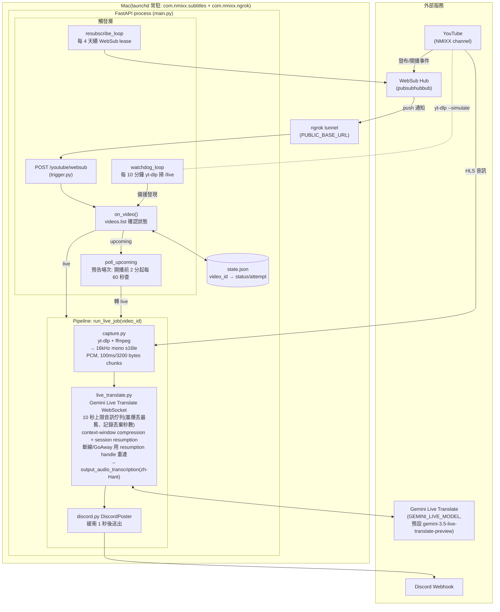

# 架構設計

單一 Python process（FastAPI），跑在 Mac 上由 launchd 常駐，一次只處理一場直播。
整體分三層：**觸發層**（發現直播）、**Pipeline**（音訊 → 字幕）、**狀態與韌性**（重試與重開機恢復）。



## 觸發層（怎麼知道開播了）

主要靠 **WebSub push**：啟動時向 hub 訂閱頻道（lease 5 天，`resubscribe_loop` 每 4 天續約），
YouTube 有新影片/開播就 push 到 `POST /youtube/websub`（經 ngrok 進來）。收到後 `on_video()`
用 YouTube Data API `videos.list` 確認真實狀態：

- `live` → 直接開 job
- `upcoming` → `poll_upcoming`：排定開播前 2 分鐘開始每 60 秒查一次，2 小時沒開播就放棄
- 其他（已結束/非直播）→ 記錄後忽略

備援是 **watchdog**：每 10 分鐘用 `yt-dlp --simulate` 掃頻道 `/live` 頁，接住 WebSub 漏掉的場次。

## Pipeline（run_live_job，直播期間持續執行）

```
yt-dlp + ffmpeg → 100ms PCM chunks(16kHz mono s16le)
→ Gemini Live Translate WebSocket(zh-Hant, response_modalities=["AUDIO"])
→ output_audio_transcription(已完成的翻譯句)
→ DiscordPoster 緩衝(1s) → webhook
```

只有一個階段：音訊進、zh-Hant 文字出，沒有本機 ASR，也沒有另外一次文字翻譯 call。
model 由 `GEMINI_LIVE_MODEL` env 控制（預設 `gemini-3.5-live-translate-preview`，屬 Preview
模型）。雖然只取文字稿，但這顆模型要求 `response_modalities=["AUDIO"]` 才會產生
`output_audio_transcription`。

成本設計：Google 依音訊時長計費（非實際講話時間），約 $0.0368/分鐘，兩小時直播單一目標語言
約 **$4.42 USD**。

韌性（`live_translate.py`）：音訊佇列上限 **10 秒**，API 卡住時丟棄最舊的音訊而非無限堆積
（保住即時性），並記錄實際丟棄的秒數；靠 **context-window compression** 與
**session resumption** 撐過 Google WebSocket 每 ~10 分鐘的輪替、以及未壓縮音訊 session 的
15 分鐘上限；遇到 GoAway 或斷線就用先前存下的 resumption handle 重連；重連時會清掉未完成的
片段、並對重播的已完成句子去重，避免字幕被截斷合併或重複貼出。API/socket/語言/佇列丟棄等
錯誤一律記錄下來，絕不會靜默 fallback 回韓文原文。

## 狀態與韌性

- `state.json`（plain JSON，單 process 夠用）：以 video_id 記錄狀態機
  `upcoming → live → completed`，失敗記 `error` 並帶 attempt 數，重試上限
  `MAX_JOB_ATTEMPTS = 5` 次後標 `failed`（終態）。
- 重開機/重啟：startup 時 `_resume_stale_jobs()` 把殘留的 `live`/`error` 逐一對
  `videos.list` 重查——還在播就續跑，播完就收尾。
- launchd `KeepAlive` + `caffeinate -s` 保證 process 常駐、Mac 不睡。
- 同時間只跑一場：新直播進來時若已有 job 在跑則忽略（`start_live_job`）。

## 設定

`.env`：`DISCORD_WEBHOOK_URL`、`GEMINI_API_KEY`、`GEMINI_LIVE_MODEL`、`YOUTUBE_API_KEY`、
`PUBLIC_BASE_URL`（ngrok 網址）、`WEBSUB_VERIFY_TOKEN`、`YOUTUBE_CHANNEL_ID`。
`glossary.md` 現在是人工品質檢查清單（成員名/slang/世界觀術語），供人工複核字幕用——
Live Translate 模型不接受自訂 prompt 或 glossary，所以內容不會被注入翻譯過程。
